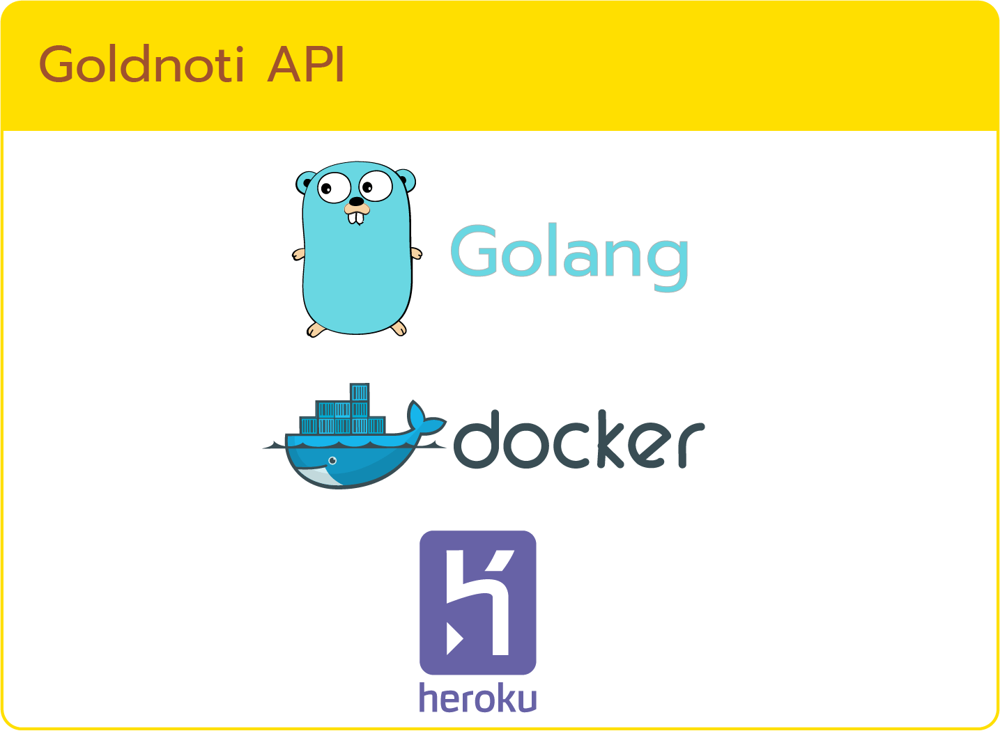

# Gold Notification

## 📘 About

Check Gold Price Today :D made for Thai and made in Thailand

## 📦 Built With

- [x] [Go v1.14](https://github.com/golang/go)
- [x] [Viper – Configuration Management](https://github.com/spf13/viper)
- [x] [Testify v1.3.0](https://github.com/stretchr/testify)
- [x] [Colly v2.1.0](https://github.com/gocolly/colly)

## 📚 Tech Stack



## 📋 Features

- [x] API Check Price for Today
- [x] API Health Check
- [ ] (Soon) LINE Chat Bot
- [ ] (Soon) LINE Chat Alert

## 📝 Documents

See more at [documents/README.md](documents/README.md)

## 🏷 Versions

v0.1.3

- Make App Supported Heroku Port Dynamically on Deployed

v0.1.2

- Added Dockerfile and docker-compose for build docker images
- Fixed Heroku Deployment (Set app stack to `container` via docker images)

v0.1.1

- Heroku Deployed

v0.1.0

- [NEW] API Check Price for Today
- [NEW] API Health Check

## ⚙ Get Started

1. Clone project

    ```bash
    git clone https://github.com/buildingwatsize/goldnoti.git
    ```

2. Go to project folder

    ```bash
    cd goldnoti
    ```

3. Set up environment

    ```bash
    export ENV=dev
    ```

4. Run project by command

    ```shell
    # Normal Mode
    go run main.go

    # Test Mode
    go test ./... -v
    ```

5. [Optional] Build Docker Images

    ```shell
    # Build with Dockerfile (ps. Don't missing . (full-stop) in the end of command!)
    docker build -t goldnoti .

    # Run docker-compose command for testing container running
    docker-compose up -d
    ```

## 😎 Author

- Chinnawat Chimdee

## ❤️ Thanks

Source 1 (JSON - Gold & Etc.): [http://www.thaigold.info/RealTimeDataV2/gtdata_.json](http://www.thaigold.info/RealTimeDataV2/gtdata_.json)

Source 2 (Web Scrapping): [https://ทองคําราคา.com](https://ทองคําราคา.com)

Source 3 (JSON): [https://thai-gold-api.herokuapp.com/latest](https://thai-gold-api.herokuapp.com/latest)
